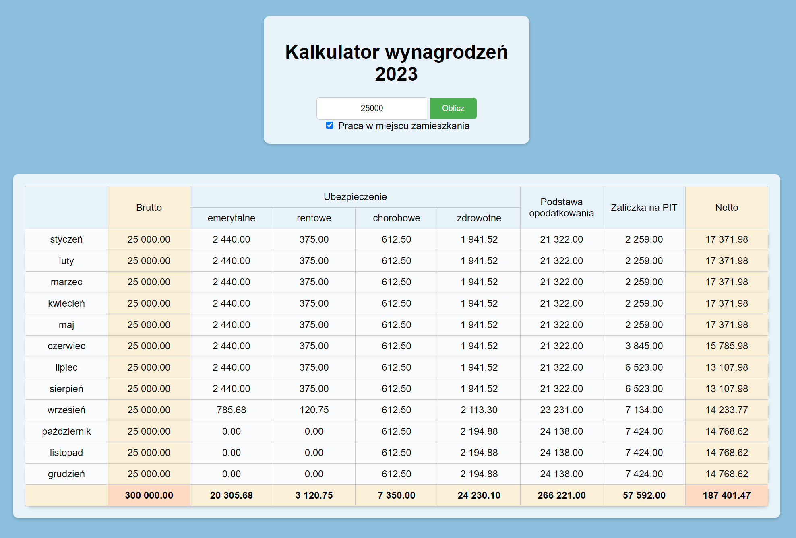

# Salary Calculator 2023 Polish regulations

A website where, in accordance with Polish regulations, you can calculate the salary in 2023 from the gross amount. It gives the exact result in the table, where it shows the net remuneration due, as well as the calculated individual social security contributions, the tax base, and the tax amount. The calculator takes into account tax thresholds (12% and 32%), calculates social security contributions up to the maximum amount, i.e. 30 times the forecasted average monthly salary (208 050.00 in 2023).

Link to the page
https://kalkulator-wynagrodzen.onrender.com

